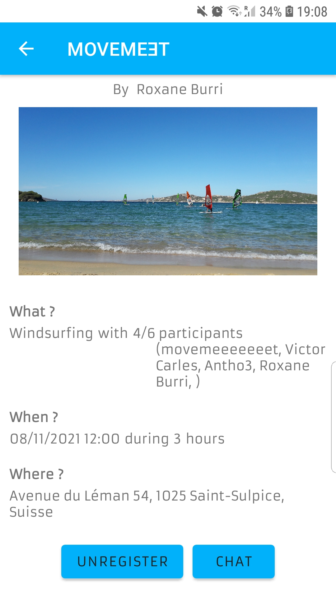

# *movemeet*

### SDP - spring semester 2021

## Build

## Maintainability

## Test Coverage

This app was created for the CS-306 Software Development Project course.

**movemeet** is an Android application allowing you to organize any type of sports activity. The user can either join activities or plan an activity at the location he wants directly via an interactive map. He can then add a description to his activity and invite partners to join him! Each activity has its own chat allowing participants to communicate in a simple and efficient way. The app includes additional features such as workout exercises and the possibility to record your GPS track during a run or a walk.

### Technologies
* This software is an Android app developed with Android Studio and written in Java.
* Firebase is used for the backend data management (user accounts, sports activity parameters) and for the chat.

### Developers
* Roxane Burri
* Victor Carles
* Anthony Guinchard
* Jean-Luc Stoupy
* Mark Tropin
* Kepler Warrington-Arroyo

### The application
Welcome to Movemeet !

The application is very easy to use with a drop-down panel

As you can see, there are a lot of activities in the world !

But don't worry, there are also activities near you !

You can add new activities everywhere :

Add a new activity is very easy

To enter the time of your choice, there is a very easy to use clock

You can see beautiful activities :

If you like this activity, you can register

But don't worry, you can unregister

Let's see the chat !

Also for running activity, you can record your run :

Now after this good run, we can check our profile 

We can modify this profile

   
   
We hope you will like this application, and see you soon for an activity !
