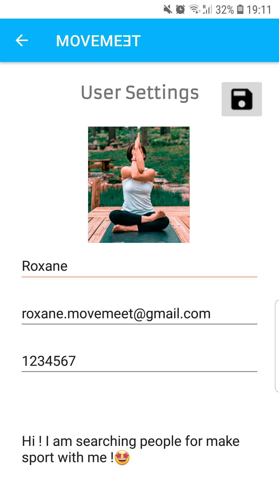

# *movemeet*

## SDP - spring semester 2021

This app was created for the CS-306 Software Development Project course.

**movemeet** is an Android application allowing you to organize any type of sports activity. The user can either join activities or plan an activity at the location he wants directly via an interactive map. He can then add a description to his activity and invite partners to join him! Each activity has its own chat allowing participants to communicate in a simple and efficient way. The app includes additional features such as workout exercises and the possibility to record information about your GPS track during a run.

[ 1. App overview ](#sec_1)

 &nbsp;&nbsp;&nbsp;&nbsp;&nbsp;&nbsp; [ 1.1 Discover **movemeet** ](#sec_1_1)
 
 &nbsp;&nbsp;&nbsp;&nbsp;&nbsp;&nbsp; [ 1.2 Create activity ](#sec_1_2)
 
 &nbsp;&nbsp;&nbsp;&nbsp;&nbsp;&nbsp; [ 1.3 Register to activity ](#sec_1_3)
 
 &nbsp;&nbsp;&nbsp;&nbsp;&nbsp;&nbsp; [ 1.4 Chat ](#sec_1_4)
 
 &nbsp;&nbsp;&nbsp;&nbsp;&nbsp;&nbsp; [ 1.5 Record GPS data ](#sec_1_5)
 
 &nbsp;&nbsp;&nbsp;&nbsp;&nbsp;&nbsp; [ 1.6 Edit profile ](#sec_1_6)

[ 2. Technologies ](#sec_2)

[ 3. Requirements ](#sec_3)

[ 4. Developers ](#sec_4)

## 1. App overview

---

### 1.1 Discover **movemeet**

Welcome to **movemeet**!

Our application contains a navigation drawer which makes it simple and easy to use.

Sport activities created around the world can be visualised at a glance on the map!

Have a look around and maybe you'll find some activities in your area.

### 1.2 Create activity

By simply clicking on the map, you can create your own activities wherever you want.

Adding a new activity is then very easy. You simply have to fill the form and specify what, when and where.

You can specify the exact time of your activity with a commonly used Android clock.

### 1.3 Register to activity

You can access the activity's information by clicking on its icon on the map. If you are interested in the activity, you can simply register by clicking the REGISTER button.

If for some reason you are no longer available for the activity, you can also unregister by clicking on UNREGISTER.

### 1.4 Chat

Each activity has its own chat room where participants can get to know each other and organise themselves.

### 1.5 Record GPS data

For running activities, GPS allows you to record data about your performance.

### 1.6 Edit profile

From the navigation drawer, you can also adjust your profile data and picture.

---

We hope you will enjoy this application and that it will help you to easily organise unforgettable sports experiences!

## 2. Technologies
* This software is an Android app developed with Android Studio and written in Java.
* Google Firebase is used for the backend data management (user accounts, sports activity parameters) and for the chat.
* The location APIs available in Google Play services are used to implement our GPS tracking feature.  

## 3. Requirements
1. **Correctness**: Our application is easy to use and includes features which are consistent with the Android user experience.

[comment]: <> (All of the app’s features must work as intended, in a way that is clear to users and coherent with the Android experience.)

2. **Utility**: Our app allows its users to connect with other people who want to go out and have fun playing sports and working out.

[comment]: <> (The app must accomplish a compelling task, with clear use cases.)

3. **Split app model**: We used Firebase (a backend solution provided by Google) for the backend data management (user accounts, sports activity parameters) and for the activity chats. More precisely, *Firebase Firestore* is used to store users and activities' data under the form of documents, *Firebase Cloud Storage* is used to store the users' profile pictures and the header pictures of the activities, *Firebase Realtime Database* is used to store the chat messages of the different chat rooms under the form of nodes and finally *Firebase Authentication* is used to provide an end-to-end identity solution for the sign-in and onboarding experience using email and password.     

[comment]: <> (The app must include some public cloud service, such as Google Firebase. In general, you are not allowed to write your own backend, but exceptions can be made in very rare cases that need to be approved by Prof. Candea.)

4. **Sensor usage**: Our app uses the GPS to record information about a running activity track. The GPS recordings are processed to display the distance, the time and the user's average speed regarding his running session. 

[comment]: <> (The app must use at least one of the phone sensors, such as the GPS, camera or microphone, as part of its core features. This means the app should make sophisticated use of sensor data, and not just read the data to store it in a field and forget about it.)

5. **User support**: The Firebase email and password authentication has been chosen to register users in our app so that they can benefit from the features requiring an account (such as editing their profile, creating activities, registering to activities, etc.).  

[comment]: <> (The app must support the concept of users, and provide authentication. We recommend you use the built-in Google authentication, but you can also use others such as EPFL’s Tequila.)

6. **Local cache**: Our app locally stores the activity header pictures so that they can be viewed in offline mode. More precisely, the process consists of first loading the image from the cache in any case (if it is available) and, then, checking if a new image is available in the database. If this is the case, the activity header picture is updated.    

[comment]: <> (The app must store data on the phone itself, for instance using local files or a SQLite database, as a cache to avoid excessive network requests. This data must be meaningfully accessed at least once every time the app is used.)

7. **Offline mode**: In offline mode, in case the app doesn't remember the user's credentials, the user can at least access the no account mode, visualize the activities on the map and display their information by clicking on the icons. In case the user has previously clicked at least once on an activity with a header picture in online mode, its image is saved in the local cache for offline mode.  

[comment]: <> (The app should work, perhaps with reduced functionality, even when no Internet connection is available. For instance, it could show data in read-only mode based on a cache.)

8. **Testing**: We created a thorough test suite, for both the core logic and the user interface of our app, that validates its correctness in most cases with meaningful assertions. Here is the current state of our test coverage: .

[comment]: <> (Your app must have a thorough test suite, for both its core logic and its user interface, that validates its correctness. We expect you to have high test coverage at all times.)

## 4. Developers
* Roxane Burri
* Victor Carles
* Anthony Guinchard
* Jean-Luc Stoupy
* Mark Tropin
* Kepler Warrington-Arroyo
